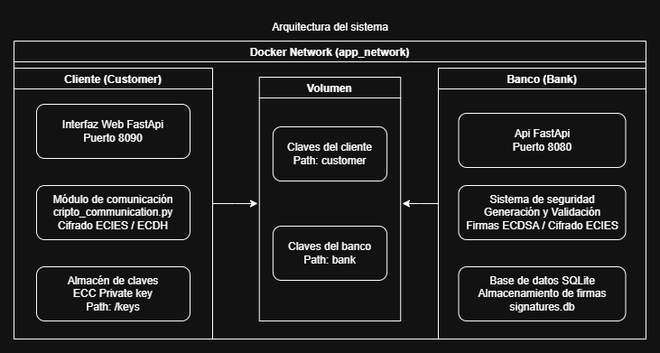
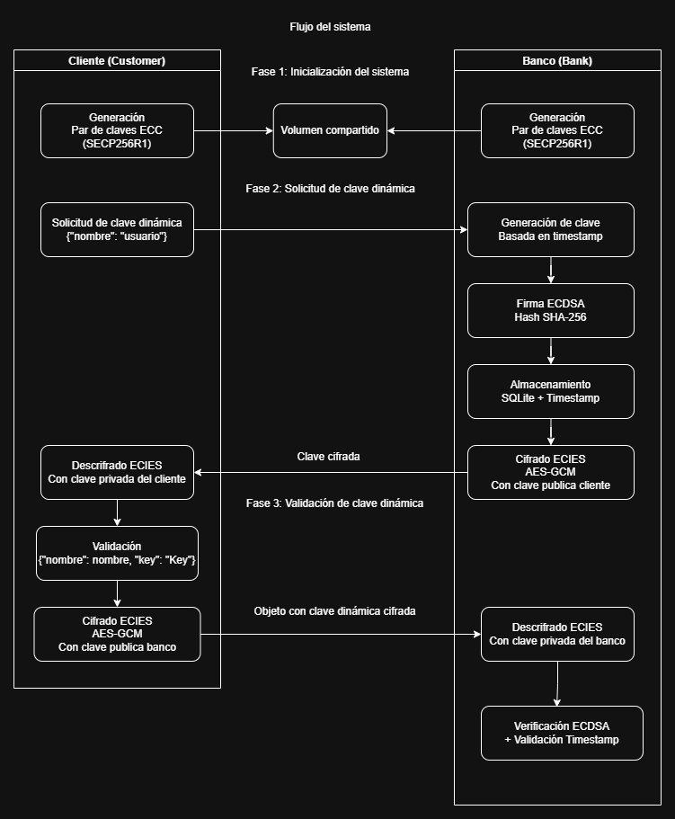

# Sistema de Autenticación de Clave Dinámica Banco-Cliente

Este proyecto implementa un sistema seguro de comunicación entre un banco y sus clientes, permitiendo la generación y validación de claves dinámicas temporales a través de una arquitectura de contenedores Docker.

## Arquitectura del Sistema

El sistema consta de dos servicios principales:

1. **Servicio Banco**: Genera claves dinámicas, las firma y valida las peticiones de los clientes.
2. **Servicio Cliente**: Interfaz web que permite a los usuarios solicitar claves dinámicas al banco y validarlas.

## Estructura de Directorios

```
├── bank/
│   ├── crypto_communication.py
│   ├── db_sqlite.py
│   ├── ecc.py
│   ├── main.py
│   └── requirements.txt
├── customer/
│   ├── crypto_communication.py
│   ├── main.py
│   ├── requirements.txt
│   └── templates/
│       ├── get_key.html
│       ├── index.html
│       ├── key.html
│       └── validation.html
├── shared-folder/
│   ├── bank/
│   │   └── shared/
│   └── customer/
│       └── shared/
└── docker-compose.yml
```

## Pasos para Desplegar el Sistema

### 1. Preparación del Entorno

Primero, clone el repositorio y cree la estructura de directorios necesaria:

```bash
git clone <url-del-repositorio>
cd <nombre-del-repositorio>

# Crear directorios para compartir claves en caso tal que estos no se creen automáticamente
mkdir -p shared-folder/bank/shared
mkdir -p shared-folder/customer/shared
```

### 2. Construir y Desplegar los Contenedores

```bash
docker-compose up -d --build
```

Este comando construirá las imágenes de Docker para el banco y el cliente, y desplegará los contenedores.

### 3. Verificar el Despliegue

Verifique que los servicios estén funcionando correctamente:

```bash
docker-compose ps
```

Debería ver dos servicios en ejecución: `bank` y `customer`.

### 4. Acceder a la Interfaz del Cliente

Abra un navegador web y acceda a:

```
http://localhost:8090
```

Desde aquí podrá:
- Solicitar una clave dinámica al banco
- Validar una clave dinámica

## Flujo de Operación

1. **Generación de Claves ECC**:
   - Al iniciar, tanto el banco como el cliente generan sus pares de claves ECC
   - Las claves públicas se comparten a través de los volúmenes montados

2. **Solicitud de Clave Dinámica**:
   - El cliente envía su nombre al banco
   - El banco genera una clave temporal de 6 dígitos basada en el timestamp
   - La clave es firmada usando ECDSA y registrada en la base de datos
   - El banco cifra la clave usando la clave pública del cliente (ECIES)
   - El cliente recibe la clave cifrada y la descifra con su clave privada

3. **Validación de Clave**:
   - El cliente envía su nombre y la clave al banco
   - La clave es cifrada usando la clave pública del banco
   - El banco descifra la clave y verifica la firma ECDSA
   - El banco valida que la clave no haya expirado (30 segundos)
   - El banco devuelve el resultado de la validación

## Detalles Técnicos del Sistema de Seguridad

### Mecanismo de Cifrado ECIES

El sistema implementa ECIES (Elliptic Curve Integrated Encryption Scheme) que combina:

1. **Intercambio de Claves ECDH**: Para cada mensaje se genera una clave efímera
2. **Derivación de Claves HKDF**: A partir del secreto compartido ECDH
3. **Cifrado Simétrico AES-GCM**: Proporciona confidencialidad y autenticidad
4. **Vector de Inicialización (IV)**: Generado aleatoriamente para cada mensaje

### Sistema de Firmas ECDSA

Para la autenticación de claves dinámicas:

1. El banco genera una clave temporal basada en timestamp
2. La clave es firmada usando la clave privada ECDSA del banco
3. La firma se almacena en la base de datos junto con el nombre y timestamp
4. Al validar, se verifica la firma usando la clave pública del banco

### Comunicación entre Contenedores

Los contenedores se comunican a través de una red Docker dedicada (`app_network`), y comparten claves públicas mediante volúmenes Docker:

- `/keys/shared` contiene las claves públicas de cada servicio
- Los servicios acceden a las claves públicas del otro servicio a través de estos volúmenes

## Pruebas del Sistema

1. **Obtención de Clave Dinámica**:
   - Acceda a http://localhost:8090/get-key
   - Introduzca un nombre y obtenga su clave dinámica
   - Observe cómo se muestra tanto la clave cifrada como la descifrada

2. **Validación de Clave**:
   - Utilice la clave obtenida para validarla
   - Observe que las claves son válidas por solo 30 segundos

## Consideraciones de Seguridad

- Las claves privadas nunca abandonan sus respectivos contenedores
- Todas las comunicaciones entre servicios están cifradas
- Las claves tienen un tiempo de vida limitado (30 segundos)
- Se utiliza criptografía de curva elíptica moderna (SECP256R1)
- El cifrado AES-GCM proporciona autenticación además de confidencialidad

## Limitaciones Actuales y Posibles Mejoras

- Implementar TLS para la comunicación entre contenedores
- Añadir autenticación de usuarios más robusta
- Mejorar la gestión de errores y reintentos
- Implementar rotación de claves periódica
- Añadir registros de auditoría detallados

## Diagrama de arquitectura


## Flujo de trabajo

